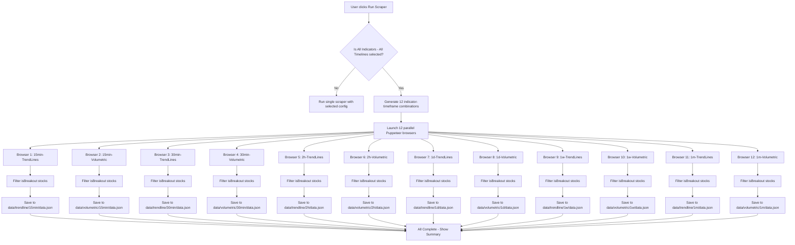

# All Indicators - All Timeframes Feature Plan

## Overview

This plan outlines the implementation of a new feature that allows users to run the stock scraper across all indicators and all timeframes simultaneously. When activated, the system will launch 12 parallel Puppeteer browser instances to scrape data for every combination of indicators and timeframes.

## Current State Analysis

### Existing Timeframes (from [`config.js`](config.js:4))

- 5mi (5 Minutes)
- 15m (15 Minutes)
- 2h (2 Hours)
- 1d (1 Day)
- 1w (1 Week)
- 1m (1 Month)

### Existing Indicators (from [`config.js`](config.js:27))

- TrendLines
- Volumetric-Ulgo

### Data Folder Structure (from [`data/`](data/))

```
data/
├── trendline/
│   ├── 15min/
│   ├── 2h/
│   ├── 1d/
│   ├── 1w/
│   └── 1m/
└── volumetric/
    ├── 15min/
    ├── 2h/
    ├── 1d/
    ├── 1w/
    └── 1m/
```

## Requirements

### 1. Add 30-Minute Timeframe

- The [`thirtyMinuteButtonSelector`](config.js:12) already exists in config.js
- Need to add "30m" to the timeframes array
- Need to add 30min folders to data structure

### 2. New UI Options

- Add "30 Minutes" option to timeframe dropdown
- Add "All Indicators - All Timelines" option to timeframe dropdown
- Add "All Indicators" option to indicator dropdown
- Auto-switch indicator to "All Indicators" when "All Indicators - All Timelines" is selected

### 3. Parallel Scraping

When "All Indicators - All Timelines" is selected, launch 12 browser instances:

| #   | Timeframe | Indicator       |
| --- | --------- | --------------- |
| 1   | 15min     | TrendLines      |
| 2   | 15min     | Volumetric-Ulgo |
| 3   | 30min     | TrendLines      |
| 4   | 30min     | Volumetric-Ulgo |
| 5   | 2h        | TrendLines      |
| 6   | 2h        | Volumetric-Ulgo |
| 7   | 1d        | TrendLines      |
| 8   | 1d        | Volumetric-Ulgo |
| 9   | 1w        | TrendLines      |
| 10  | 1w        | Volumetric-Ulgo |
| 11  | 1m        | TrendLines      |
| 12  | 1m        | Volumetric-Ulgo |

### 4. Data Storage

Save breakout stocks to local data folder:

- Path format: `data/{indicator}/{timeframe}/data.json`
- Only save stocks where `isBreakout === true`
- Example: `data/trendline/15min/data.json`

## Architecture

### Flow Diagram



## Implementation Details

### 1. Config Updates ([`config.js`](config.js))

```javascript
// Add 30m to timeframes array
timeframes: ["5mi", "15m", "30m", "2h", "1d", "1w", "1m"],

// thirtyMinuteButtonSelector already exists at line 12
```

### 2. Frontend Updates ([`public/index.html`](public/index.html))

#### Timeframe Dropdown Changes

```html
<select id="timeframe" name="timeframe">
  <option value="5mi">5 Minutes</option>
  <option value="15m">15 Minutes</option>
  <option value="30m">30 Minutes</option>
  <!-- NEW -->
  <option value="2h" selected>2 Hours</option>
  <option value="1d">1 Day</option>
  <option value="1w">1 Week</option>
  <option value="1m">1 Month</option>
  <option value="all">All Indicators - All Timelines</option>
  <!-- NEW -->
</select>
```

#### Indicator Dropdown Changes

```html
<select id="indicator" name="indicator">
  <option value="TrendLines" selected>TrendLines</option>
  <option value="Volumetric-Ulgo">Volumetric-Ulgo</option>
  <option value="all">All Indicators</option>
  <!-- NEW -->
</select>
```

#### JavaScript Logic for Auto-Switch

```javascript
document.getElementById("timeframe").addEventListener("change", function () {
  if (this.value === "all") {
    document.getElementById("indicator").value = "all";
    document.getElementById("indicator").disabled = true;
  } else {
    document.getElementById("indicator").disabled = false;
  }
  updateConfigSummary();
});
```

### 3. Backend Updates ([`main.js`](main.js))

#### Add 30m to getButtonSelector

```javascript
const getButtonSelector = (timeframe) => {
  const selectorMap = {
    "5mi": config.fiveMinuteButtonSelector,
    "15m": config.fifteenMinuteButtonSelector,
    "30m": config.thirtyMinuteButtonSelector, // NEW
    "2h": config.twoHourButtonSelector,
    "1d": config.dailyButtonSelector,
    "1w": config.weeklyButtonSelector,
    "1m": config.monthlyButtonSelector,
  };
  return selectorMap[timeframe] || config.dailyButtonSelector;
};
```

#### New Function: runAllIndicatorsAllTimeframes

```javascript
const runAllIndicatorsAllTimeframes = async (baseConfig) => {
  const timeframes = ["15m", "30m", "2h", "1d", "1w", "1m"];
  const indicators = ["TrendLines", "Volumetric-Ulgo"];

  const combinations = [];
  for (const timeframe of timeframes) {
    for (const indicator of indicators) {
      combinations.push({ timeframe, indicator });
    }
  }

  console.log(
    `Starting parallel scraping for ${combinations.length} combinations...`
  );

  const promises = combinations.map(async ({ timeframe, indicator }) => {
    const config = {
      ...baseConfig,
      timeframe,
      indicatorName: indicator,
    };

    try {
      const result = await main(config);
      const breakoutStocks = result.filter(
        (stock) => stock.isBreakout === true
      );

      // Save to local data folder
      await saveToLocalDataFolder(breakoutStocks, indicator, timeframe);

      return {
        timeframe,
        indicator,
        success: true,
        breakoutCount: breakoutStocks.length,
      };
    } catch (error) {
      return {
        timeframe,
        indicator,
        success: false,
        error: error.message,
      };
    }
  });

  const results = await Promise.all(promises);
  return results;
};
```

### 4. New File: handleLocalDataWriting.js

```javascript
const fs = require("fs").promises;
const { existsSync } = require("fs");
const path = require("path");

const getIndicatorFolderName = (indicatorName) => {
  const map = {
    TrendLines: "trendline",
    "Volumetric-Ulgo": "volumetric",
  };
  return map[indicatorName] || "unknown";
};

const getTimeframeFolderName = (timeframe) => {
  const map = {
    "15m": "15min",
    "30m": "30min",
    "2h": "2h",
    "1d": "1d",
    "1w": "1w",
    "1m": "1m",
  };
  return map[timeframe] || timeframe;
};

const saveToLocalDataFolder = async (
  breakoutStocks,
  indicatorName,
  timeframe
) => {
  const indicatorFolder = getIndicatorFolderName(indicatorName);
  const timeframeFolder = getTimeframeFolderName(timeframe);

  const dataDir = path.join(
    __dirname,
    "data",
    indicatorFolder,
    timeframeFolder
  );
  const dataPath = path.join(dataDir, "data.json");

  // Create directory if it doesn't exist
  if (!existsSync(dataDir)) {
    await fs.mkdir(dataDir, { recursive: true });
  }

  const dataToSave = {
    timestamp: new Date().toISOString(),
    indicator: indicatorName,
    timeframe: timeframe,
    totalBreakouts: breakoutStocks.length,
    stocks: breakoutStocks,
  };

  await fs.writeFile(dataPath, JSON.stringify(dataToSave, null, 2), "utf-8");
  console.log(`Saved ${breakoutStocks.length} breakout stocks to ${dataPath}`);

  return dataPath;
};

module.exports = { saveToLocalDataFolder };
```

### 5. Update handleWriteFile.js

Add 30min mapping to [`getTimeframeFolderName`](handleWriteFile.js:10):

```javascript
const getTimeframeFolderName = (timeframe) => {
  const timeframeMap = {
    "5mi": "5min",
    "15m": "15min",
    "30m": "30min", // NEW
    "2h": "2hour",
    "1d": "daily",
    "1w": "weekly",
    "1m": "monthly",
  };
  return timeframeMap[timeframe] || "daily";
};
```

### 6. API Endpoint Update

Update [`/api/run-scraper`](main.js:323) to handle "all" mode:

```javascript
app.post("/api/run-scraper", async (req, res) => {
  try {
    if (isCurrentlyProcessing) {
      return res.status(400).json({
        success: false,
        message: "Scraper is already running",
      });
    }

    const { timeframe, indicator, batchSize, headless, liveMode } = req.body;

    // Handle "all" mode
    if (timeframe === "all" || indicator === "all") {
      const baseConfig = {
        batchSize: parseInt(batchSize),
        headless: Boolean(headless),
        LIVE_MODE: Boolean(liveMode),
      };

      isCurrentlyProcessing = true;
      const results = await runAllIndicatorsAllTimeframes(baseConfig);
      isCurrentlyProcessing = false;

      return res.json({
        success: true,
        mode: "all",
        message: "All indicators and timeframes processed",
        results: results,
      });
    }

    // Existing single-mode logic...
  } catch (error) {
    // Error handling...
  }
});
```

## Data Folder Structure After Implementation

```
data/
├── trendline/
│   ├── 15min/
│   │   └── data.json
│   ├── 30min/        <!-- NEW -->
│   │   └── data.json
│   ├── 2h/
│   │   └── data.json
│   ├── 1d/
│   │   └── data.json
│   ├── 1w/
│   │   └── data.json
│   └── 1m/
│       └── data.json
└── volumetric/
    ├── 15min/
    │   └── data.json
    ├── 30min/        <!-- NEW -->
    │   └── data.json
    ├── 2h/
    │   └── data.json
    ├── 1d/
    │   └── data.json
    ├── 1w/
    │   └── data.json
    └── 1m/
        └── data.json
```

## data.json Format

```json
{
  "timestamp": "2026-01-15T12:00:00.000Z",
  "indicator": "TrendLines",
  "timeframe": "15m",
  "totalBreakouts": 5,
  "stocks": [
    {
      "scripname": "RELIANCE",
      "LONG_NAME": "Reliance Industries Ltd",
      "ltradert": 2450.75,
      "value": 2400.0,
      "isBreakout": true,
      "comp_name": "Reliance Industries Limited",
      "current_market_price": 2450.75,
      "trendline_strength": 1,
      "pivot_point_strength": 1,
      "ema_strength": 1,
      "rs_strength": 1,
      "change_percent": 2.5,
      "trd_vol": 1500000,
      "scrip_cd": "RELIANCE"
    }
  ]
}
```

## Files to Modify

| File                                       | Changes                                                              |
| ------------------------------------------ | -------------------------------------------------------------------- |
| [`config.js`](config.js)                   | Add "30m" to timeframes array                                        |
| [`public/index.html`](public/index.html)   | Add 30min, All Indicators - All Timelines options, auto-switch logic |
| [`main.js`](main.js)                       | Add 30m selector mapping, new parallel scraping function, update API |
| [`handleWriteFile.js`](handleWriteFile.js) | Add 30min timeframe mapping                                          |

## New Files to Create

| File                        | Purpose                                           |
| --------------------------- | ------------------------------------------------- |
| `handleLocalDataWriting.js` | Save breakout data to local data folder structure |
| `data/trendline/30min/`     | New folder for 30min trendline data               |
| `data/volumetric/30min/`    | New folder for 30min volumetric data              |

## Testing Checklist

- [ ] Verify 30min option appears in timeframe dropdown
- [ ] Verify "All Indicators - All Timelines" option appears in timeframe dropdown
- [ ] Verify "All Indicators" option appears in indicator dropdown
- [ ] Verify indicator auto-switches to "All Indicators" when "All Indicators - All Timelines" is selected
- [ ] Verify indicator dropdown is disabled when "All Indicators - All Timelines" is selected
- [ ] Verify 12 browser windows launch when running with "All Indicators - All Timelines"
- [ ] Verify data is saved to correct paths in data folder
- [ ] Verify only breakout stocks are saved to data.json files
- [ ] Verify existing single-mode functionality still works

## Risk Considerations

1. **Resource Usage**: Running 12 parallel browser instances will consume significant memory and CPU
2. **Rate Limiting**: TradingView may rate-limit requests if too many are made simultaneously
3. **Error Handling**: Need robust error handling for individual browser failures without affecting others
4. **Timeout Management**: Each browser instance needs proper timeout handling

## Mitigation Strategies

1. Consider running browsers in batches of 4 instead of all 12 at once
2. Add delays between browser launches to avoid rate limiting
3. Implement retry logic for failed browser instances
4. Add progress tracking to show which combinations have completed

## Summary

This implementation will enable users to run comprehensive stock analysis across all indicators and timeframes with a single click. The data will be saved locally in a structured format for easy access and further analysis.
